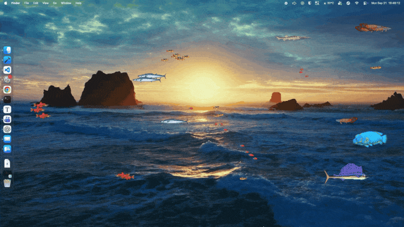
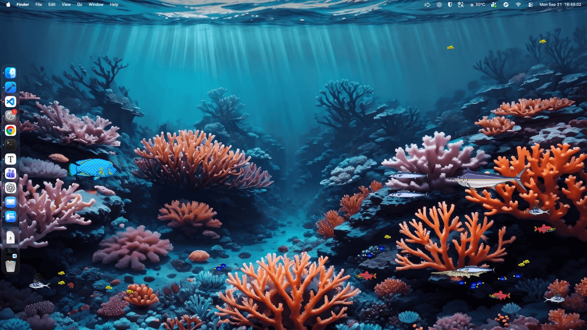
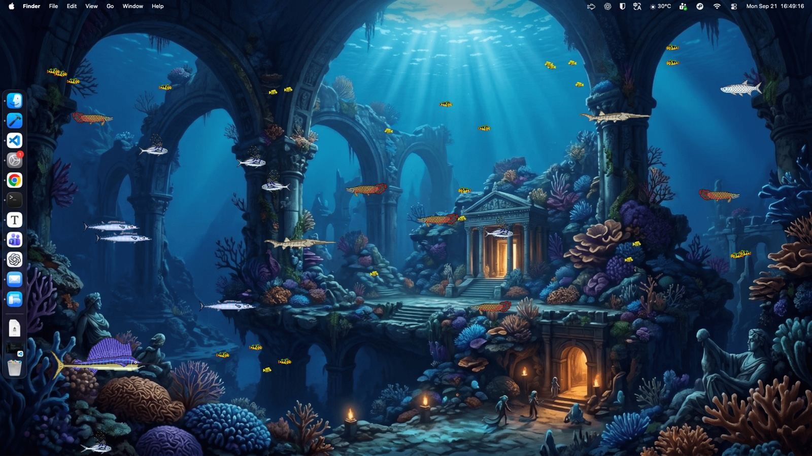

# 桌面水族馆

一缸养在 macOS 桌面上的鱼：17 种鱼自己群游、捕食、躲你的鼠标。

## 为什么做

我每天面对时间最长的一块屏幕是桌面，可它一直是静止的。

壁纸换过不少，换来换去都还是张图。动态壁纸也试过，海浪永远按同一段循环在动，看两天就知道下一秒会发生什么。

屏保更不合适，它只在我离开的时候出现，回来动一下鼠标就没了，等于只表演给我看不见的时候。

所以我想要的是**一块一直在那儿、但每次看都不一样的东西**：不用点开，不用切换，抬头看一眼，几秒钟，然后继续干活。

就做了一缸鱼，养在桌面上。

## 关键的取舍

**画在桌面这一层，不做成壁纸。** 鱼住在一个无边框窗口里，窗口挂在桌面图标那一层（`CGWindowLevelForKey(.desktopIconWindow)`）。好处是换壁纸、改分辨率、接外接显示器都不用管它，而且它永远在别的窗口下面，不挡任何东西。代价是它也永远不会盖在窗口上面，想看清它得先让桌面露出来。

**平时不吃鼠标。** 默认开着 `ignoresMouseEvents`，点图标、拖文件、右键、框选全都正常，鱼完全透明地待在后面。只有手动打开「投喂与互动模式」，它才开始接管鼠标。代价是多一次开关，换来的是你不会某天发现桌面点不动了。

**会自己退让。** 切到别的桌面、点了其他 App，互动模式自动关掉。这条是后补的——一开始经常出现桌面上点不动，找半天才发现是自己还开着互动模式。

**有声音，但很轻。** 环境底噪 1.5 秒淡入，鱼冲刺时带一声气泡，而且做了空间音频：鱼在屏幕左边，声音从左耳来。代价是它一直在后台出声，开会或者录音之前得记得关掉。

## 鱼在想什么

每条鱼都没有剧本，每帧只算一次「我现在想去哪」。规则就下面几条。

### 群游

小鱼之间跑 Boids：**分离**（别挤成一坨）、**对齐**（跟同伴朝一个方向）、**凝聚**（别掉队）。

这里加了一条不太标准的规则：**只有同类才对齐**。纯 Boids 会把所有鱼搅成一团，加上物种隔离之后，蓝鱼跟着蓝鱼、金鲷跟着金鲷，缸里才像有几个不同的鱼群。

### 捕食

剑鱼和旗鱼是捕食者。它们在视野里锁定最近的一条小鱼，按距离分三段处理：400 像素内开始留意，150 像素内全力猛扑（2.5 倍速），贴到 70 像素以内算咬到，然后进冷却——接下来一段时间游得慢吞吞的，像刚吃完饭。

被盯上的小鱼会跑，而且跑得很慌：2 倍速，方向上叠一个正弦波左右摇摆，走蛇皮路线。这个「扭屁股」的幅度直接决定追不追得上，也是调得最久的一个参数。

### 鼠标是上帝之手

任何鱼靠近鼠标 150 像素以内都会炸开，3.5 倍速往反方向逃，比被大鱼追还快。所以来回晃晃鼠标，就能把一缸鱼搅得乱七八糟。这是整个 App 里最喜欢的一处。

### 喂食

互动模式下点一下桌面，撒下一颗鱼食，慢慢往下沉。300 像素内的小鱼会看见它，2.5 倍速冲过来抢，抢到的原地吧唧一下嘴。

### 摆尾和气泡

尾巴不是逐帧动画，是一段 shader：把鱼身按 `pow(uv.x, 2.5)` 做横向正弦形变，越靠尾巴摆得越凶，看着像是从身体中间发力甩出去的。

摆尾频率跟着游速走，但设了上限——不设的话鱼一冲刺，尾巴就变成高频马达。气泡同理：速度超过平时 1.5 倍才开始喷，大鱼的气泡又大又散得慢，小鱼只是一小串，转眼就没了。

## 控制台

菜单栏一个鱼图标，点开就是全部设置：投喂与互动、音效开关、鱼放哪块显示器、只在这一桌面还是所有桌面、场景背景（透明 / 深海蓝 / 珊瑚礁），最下面还有一个骰子按钮——**随机重置生态**。

一缸鱼是这么抽出来的：1 条捕食者 + 2 种大鱼 + 3 种中鱼 + 2 种小鱼。一共 17 种鱼，每种有自己的游速、转身快慢、体型和群游权重，抽一次大概三四十条。看腻了就重掷，跟换鱼缸一样。

## 踩过的坑

功能写完只花了两个晚上，剩下时间都在让它别跟系统打架。

**启动白屏。** 窗口先以 alpha 0 建出来，等 0.3 秒第一帧渲染完，再用 0.8 秒淡入。直接显示的话会看到一瞬间白屏，比没有效果还难看。

**切桌面时音频崩溃。** 系统切换桌面的那零点几秒是「高负载区」，这时候去动音频引擎容易出问题。现在切完桌面等 0.2 秒再处理。

**大鱼追小鱼的「二人转」。** 两条鱼追着追着开始原地绕圈，小鱼还疯狂左右摆头。原因是大鱼在很近的距离上不停重算朝向，小鱼则反复翻转贴图。修法是给转向加一个动态死区：横向速度没超过当前速度的 6% 就不翻面。

**SwiftUI 和 AppKit 撞死。** 控制面板里每个开关，状态写入都推迟到下一个主线程周期再执行。不这么做，改一个设置就会和窗口布局递归撞在一起，卡住。

**分辨率变化。** 接外接显示器时系统会连发好几次屏幕参数变化通知，加了 0.5 秒防抖，只在最后一次真正稳定时才挪窗口。

## 关于素材

代码是我写的，鱼和背景的插画、环境音用的是现成素材，版权归各自原作者，不在 MIT 协议范围内。想拿去改的话，建议先把素材换成自己的。

## 回头看

动手之前我以为难的是让鱼游得像鱼。真做下来发现，让鱼游得像鱼只需要调参数，难的是**让这几千行代码和 macOS 和平共处**：窗口层级、鼠标事件、音频、多显示器，每一个都能做到「效果看着没问题，但让系统变得别扭」。

参数也调了很多轮。有一晚把捕食冲刺从 2.5 倍调到 3.0，第二天打开发现整缸鱼像受惊的麻雀，只好调回去。鱼不知道你的参数是什么意思，它只按你写的规则行动，但看起来像不像活的，是它说了算。

> 整齐的鱼群看起来像壁纸，乱一点才像活的。

## 跑起来

- macOS 14 或更新版本，用 Xcode 打开 `DesktopAquarium.xcodeproj`，选 `DesktopAquarium` scheme 运行。
- 启动后不会出现窗口，也不占 Dock；菜单栏上的鱼图标就是控制台。
- 仓库里还有另一个 target `AquariumSaver`，把同一缸鱼搬进屏保，完成度不如主 App。

## 协议

代码用 [MIT](./LICENSE) 协议开源；鱼、背景、音效这些素材的版权归原作者，不在 MIT 范围内。
